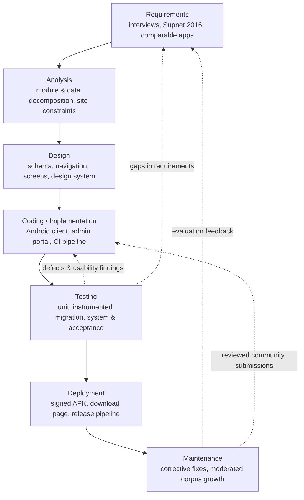
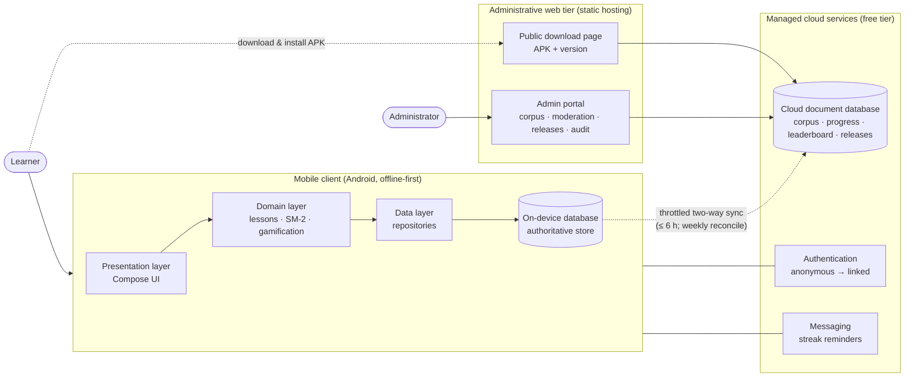
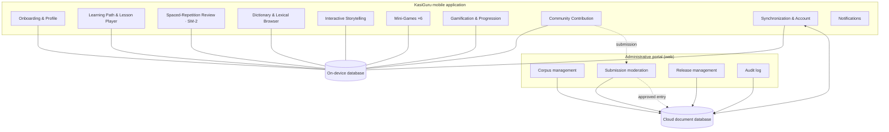
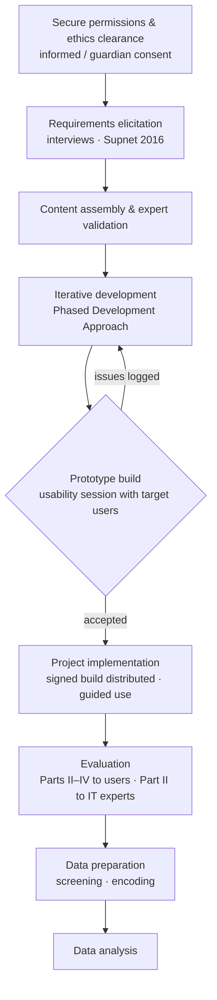

# Chapter II

> **KasiGuru: A Gamified Mobile Learning Application for the Preservation and Learning of the
> Kasiguranin Language**
> Bihasa, Erickson · Cordial, Anthony T. · Miras, Adrian Rhoman V. · Ruidera, Owen
> Aurora State College of Technology, School of Information Technology · May 2026
>
> Format: Rationale of the design decisions in Chapter I is carried forward. This chapter follows
> the format: Research Design (Project Design and Development · System Architecture · Programming
> Languages and Database Used · System Modules · Design Consideration) · Locale of the Study ·
> Respondents · Data Gathering Instrument · Data Gathering Procedure (Prototyping and Feedback ·
> Project Implementation and Evaluation) · Data Analysis Technique · Ethical Concerns.
>
> Word formatting: Times New Roman 12, double-spaced, justified, 0.5" first-line indent. Bracketed
> items in SMALL CAPS, e.g. [PARTNER SCHOOL], mark values the researchers finalize before submission.

---

## RESEARCH METHODOLOGY

This chapter describes how the study was carried out. It states the research design and the
reasoning behind it, the technical design and construction of the KasiGuru application, the site and
participants of the study, the instruments used to gather data, the procedure followed from
requirements elicitation through evaluation, the techniques used to analyze the resulting data, and
the ethical safeguards observed throughout. The chapter operationalizes the Input–Process–Output
conceptual framework presented in Chapter I: the methodology described here is the *process* by which
the study's inputs — the existing description of Kasiguranin, community-elicited material, learner and
educator requirements, and the ISO/IEC 25010 criteria — are transformed into its outputs, namely the
application, the digitized corpus, and the two evaluations.

---

## RESEARCH DESIGN

The study employed a **descriptive–developmental research design**. The design is *developmental*
because its central activity is the construction of a software artifact — the KasiGuru application
and its supporting web portal — following a defined engineering methodology. It is *descriptive*
because the study does not manipulate variables or test a causal hypothesis; it builds the artifact
and then describes its measured quality and the level at which its intended users accept it. This
pairing is the established design for information-technology capstone research in the Philippine
setting, where the researcher is expected both to deliver a working system and to report an objective
evaluation of it.

The design has two complementary strands that correspond directly to the study's research questions.
The first strand answers Research Question 1 — how the application may be developed using the Phased
Development Approach — and is addressed by documenting each phase of construction as it was performed.
The second strand answers Research Questions 2 and 3 — how the application performs against the
ISO/IEC 25010 software quality characteristics, and the level of acceptability and user satisfaction
it achieves among students and beginner learners — and is addressed through a survey administered to
user-respondents and to information-technology practitioners after the system was completed. The two
strands are not sequential silos: findings from the second strand re-enter the first as revised
requirements, which is the feedback path the conceptual framework identifies as the distinguishing
feature of this study's model.

### Project Design and Development

The application was developed using the **Phased Development Approach**, the methodology named in the
study's objectives. It proceeds through seven phases — Requirements, Analysis, Design,
Coding/Implementation, Testing, Deployment, and Maintenance — and permits controlled iteration
between phases rather than requiring each to be completed and frozen before the next begins. The
approach was selected over a strictly linear waterfall model because the corpus that the application
teaches from was itself being assembled and reviewed during development, and over a purely
exploratory model because the study required a defined, reportable structure against which progress
could be described in Chapter III.

**Requirements.** The researchers gathered functional and non-functional requirements from three
sources: semi-structured interviews and informal consultation with community speakers, educators, and
culture bearers in Casiguran; a reading of Supnet's (2016) grammatical sketch to establish the
linguistic features the system must be able to represent; and a review of comparable learning
applications to identify the interaction patterns learners already expect. The requirements were
consolidated into a specification covering the lexical database, the review scheduler, the lesson and
game modules, the gamified progression system, the offline-first constraint, the moderated
contribution pipeline, and the administrative portal.

**Analysis.** The consolidated requirements were decomposed into system modules and their
interactions, the data the system must persist, and the constraints imposed by the deployment site —
principally that the target devices are mid-range Android phones on Android 8.0 (API 26) and above,
that connectivity in Casiguran is intermittent, and that the project's cloud services must remain
within a no-cost service tier. The analysis produced the module decomposition in a later section of
this chapter, an entity model for the on-device database, and the synchronization rules that govern
when, and how sparingly, the application contacts the network.

**Design.** The researchers produced the database schema, the navigation structure, the screen
layouts, and a reusable visual design system. The database was designed as an on-device relational
store treated as the single source of truth, with a separate cloud document store used only for
synchronization and backup. The interface was designed around short, resumable sessions consistent
with the mobile-assisted learning literature. A design system — a fixed palette, a two-family
typographic scale, and a small set of reusable components — was established so that the many screens
of the application would remain visually consistent and so that later maintenance would not
reintroduce drift.

**Coding/Implementation.** The application was implemented natively for Android. The
spaced-repetition scheduler implements the SM-2 algorithm on-device, including relearning steps and
lapse tracking. The lesson module generates exercise sequences from the corpus by semantic category
with answer-level feedback. The six mini-games, the gamified progression system, the interactive
storytelling module with tap-to-define lookup, and the moderated contribution form were implemented
against the same local database. The administrative portal was implemented as a separate web
application. Source code was maintained under version control with an automated pipeline running
static analysis, unit tests, and instrumented database-migration tests on every change.

**Testing.** Testing was conducted at three levels. Unit tests covered algorithmic components,
principally the SM-2 scheduler and the content-merge logic that reconciles cloud edits with local
learning history. Instrumented tests running on an Android emulator verified that every database
schema migration preserves existing user data on upgrade. System and acceptance testing exercised
complete user journeys — onboarding, a lesson, a review session, each game, a story, and a community
submission — on physical devices. Defects found during prototyping sessions with target users were
logged, prioritized, and resolved in subsequent iterations.

**Deployment.** The application is distributed as a signed Android package installed directly on the
device rather than through a public application store, reflecting how software actually reaches users
at the study site. A public download page hosts the current package and its version history; an
automated release pipeline builds and signs the package, publishes it to the download page, and
records the release so that installed copies can detect and prompt for updates.

**Maintenance.** After deployment, maintenance consists of corrective changes arising from evaluation
feedback, and content growth through the moderated contribution pipeline, by which reviewed
community submissions enter the corpus without requiring a new release of the application. The
administrative portal supports this ongoing work.

*(See Figure 2: The Phased Development Approach as applied in this study.)*

**Figure 2 described.** A vertical flow of seven boxes — Requirements, Analysis, Design,
Coding/Implementation, Testing, Deployment, Maintenance — each feeding the next. Three dashed return
arrows run upward: from Testing to Coding (defects and usability findings) and to Requirements (gaps
in requirements), and from Maintenance to Requirements (evaluation feedback) and to Coding (reviewed
community submissions entering the corpus). The return arrows express the iteration the approach
permits and the feedback path of the conceptual framework.

### System Architecture

KasiGuru follows an **offline-first, three-tier architecture**. The tiers are the Android mobile
client, a set of managed cloud services, and an administrative web tier. The defining property of the
architecture is that the mobile client is fully functional with no network connection: every learning
activity reads from and writes to a database on the device, and the cloud is contacted only to
synchronize that database opportunistically.

**Mobile client tier.** The Android application is organized into three internal layers. The
*presentation layer* renders the interface and handles user interaction. The *domain layer* contains
the learning logic that is independent of any screen — lesson generation, the SM-2 review scheduler,
and the gamification engine that awards experience points, advances levels, maintains streaks, and
unlocks achievements. The *data layer* exposes repositories over a local relational database, which
is the authoritative store for all vocabulary, narratives, user progress, and game results.

**Cloud services tier.** The application uses a managed backend operated entirely on its provider's
free service tier. A cloud document database holds the master copy of the corpus and receives
synchronized copies of each learner's progress, the public leaderboard, in-application announcements,
and the release record. Authentication issues each installation an anonymous identity by default,
which the learner may later link to an email or a third-party account to make progress recoverable
across devices. A messaging service delivers streak reminders. Because the backend runs on a
free tier with a shared daily quota, synchronization is deliberately frugal: content is pulled at
most once every six hours, a full reconciliation runs at most weekly, and incremental pulls transfer
only documents changed since the last successful synchronization.

**Administrative web tier.** A separate web application, accessible only to authenticated
administrators, provides create-read-update-delete management of the corpus, a moderation queue for
learner-submitted vocabulary, tools for publishing and managing application releases, and an audit
log of administrative actions. A second, public web page serves the installable package and displays
the current version. Both web surfaces are static and are served from a commercial static-hosting
platform.

**Data flow.** Content flows *downward*: administrators edit the corpus in the web tier, the change
is written to the cloud document database, and mobile clients pull it on their next scheduled
synchronization. Progress flows *upward*: the client writes learning results to its local database
immediately and, when connectivity allows, mirrors them to the cloud so that a reinstalled or
replaced device can restore them. Learner contributions flow *upward and back down*: a submission
made in the client enters the moderation queue, and once an administrator approves it, it becomes
part of the corpus that all clients subsequently receive.

*(See Figure 3: System architecture of KasiGuru.)*

**Figure 3 described.** Three grouped regions. On the left, the mobile client with its presentation,
domain, and data layers stacked over an on-device database labelled as the authoritative store. In
the centre, the cloud services — a document database holding the corpus, progress, leaderboard, and
releases, plus authentication and messaging. On the right, the administrative web tier with the admin
portal and the public download page. A bidirectional dashed link between the on-device database and
the cloud document database is labelled with the synchronization throttle. The admin portal and
download page both read from and write to the cloud document database. A learner actor connects to
the client and, separately, downloads the package from the download page; an administrator actor
connects to the admin portal.

### Programming Languages and Database Used

The technologies were chosen for fitness to a native Android target, for their ability to operate
offline, and for zero licensing and hosting cost.

| Concern | Technology | Role in the study |
|---|---|---|
| Mobile application language | **Kotlin** | Primary implementation language of the Android client. |
| Mobile user interface | **Jetpack Compose** | Declarative UI toolkit used for every screen. |
| Asynchronous processing | **Kotlin Coroutines and Flow** | Background synchronization, database access, and reactive state. |
| Dependency management | **Hilt** | Compile-time dependency injection across the client. |
| On-device persistence | **Room over SQLite** | Object-relational mapping to the authoritative local database, with exported schemas and migration tests. |
| Cloud data and identity | **Cloud Firestore, Authentication, Cloud Messaging** | Corpus and progress synchronization, anonymous and linked accounts, and reminder notifications, all on the provider's free tier. |
| Web portal languages | **HTML5, CSS3, JavaScript (ES modules)** | Structure, presentation, and behaviour of the administrative and download web surfaces. |
| Web backend access | **Firebase Web SDK** | Direct, rules-enforced access from the browser to the same cloud services the client uses. |
| Build system | **Gradle** | Compilation, dependency resolution, and packaging of the Android application. |
| Version control and automation | **Git and a hosted repository with continuous-integration workflows** | Source history, and automated static analysis, unit testing, and migration testing on each change. |
| Static hosting | **A commercial static-site platform** | Serving of the administrative portal and the public download page. |

**Database.** The study uses two data stores with distinct roles. On the device, an **SQLite database
managed through Room** is the authoritative store: it holds the full lexical database, the aspectual
inflection table, the narrative collection, user progress, achievement and game records, lesson
progress, learner profiles, and a synchronization queue. Every learning function reads and writes
this store, and the application is fully usable with it alone. In the cloud, a **NoSQL document
database (Cloud Firestore)** holds the master corpus that administrators edit, a synchronized copy of
each learner's progress, the public leaderboard, system announcements, and the release record. The
on-device store is never a cache of the cloud store; the relationship is the reverse. This
arrangement was chosen because the deployment site cannot be assumed to have connectivity when a
learner opens the application, and because keeping the authoritative store on the device removes any
per-request cloud cost from the core learning loop.

### System Modules

The application is decomposed into the following modules. Each is implemented against the shared
on-device database and is independently reachable from the application's navigation.

1. **Onboarding and Profile.** A first-run flow that sets a display name, a starting daily goal, and
   an avatar, creates the learner's local profile, and hands off to a short guided tour. Supports
   multiple profiles on a shared device.

2. **Learning Path and Lesson Player.** Presents the corpus as an ordered sequence of themed units.
   The lesson player generates an exercise set for the current unit from the corpus and delivers it
   with answer-level feedback.

3. **Spaced-Repetition Review.** Schedules vocabulary for review using the SM-2 algorithm, assigning
   each item an easiness factor and interval, extending the interval after a correct recall and
   collapsing it after a lapse, with explicit relearning steps for repeatedly failed items.

4. **Dictionary and Lexical Browser.** A searchable, category-organized view of every entry, showing
   the Kasiguranin form, its Tagalog and English equivalents, root form, definitional glosses, and —
   where transcribed — IPA notation with glottal-stop and vowel-length markers.

5. **Interactive Storytelling.** Ten illustrated regional narratives with tap-to-define word lookup
   resolved against the dictionary, unlocked by accumulated experience points.

6. **Mini-Games.** Six educational games — Word Match, Reverse Match, Fill in the Blank, Word Recall,
   Sentence Order, and Aspect Builder — with star-based level progression. Aspect Builder is
   implemented against the aspectual inflection table and becomes available when that dataset is
   populated.

7. **Gamification and Progression.** Experience points awarded across all learning activities, five
   progression levels, daily streaks, twenty-five achievements, and a public leaderboard synchronized
   from the cloud.

8. **Community Contribution.** A form through which a learner submits a candidate Kasiguranin word;
   the submission enters a moderation queue and is added to the corpus only after administrator
   approval.

9. **Synchronization and Account.** Manages the anonymous identity, optional linking to an email or
   third-party account, the throttled content pull, and the upward mirroring of progress.

10. **Notifications.** Local and push reminders that prompt the learner to maintain a daily streak.

11. **Administrative Portal (web).** Corpus create-read-update-delete management, the submission
    moderation queue, release publishing and management, a private audit log, and bulk corpus
    import and backup utilities.

*(See Figure 4: Module map of KasiGuru.)*

**Figure 4 described.** The mobile application's ten modules are shown as a group, each connected to
a shared on-device database. The Synchronization and Account module additionally connects
bidirectionally to the cloud document database. The administrative portal is shown as a second group
of four modules — corpus management, submission moderation, release management, and audit log — each
writing to the cloud document database. A path runs from the mobile Community Contribution module to
the portal's moderation module, and from there, on approval, into the cloud corpus.

### Design Consideration

The following considerations governed design decisions throughout the study.

**Offline capability.** Because connectivity at the deployment site is intermittent, the application
was designed so that no learning function depends on a network. The on-device database is
authoritative; synchronization is an enhancement, not a prerequisite.

**Low-end device support and data economy.** The target devices are mid-range phones running Android
8.0 or later. The installable package is kept small; interface textures and patterns are drawn at
runtime rather than shipped as image files; and cloud traffic is minimized through the
synchronization throttle so that the application is usable on a metered or limited connection and
within a free cloud quota shared by all users.

**Accessibility.** Colour contrast was verified against Web Content Accessibility Guidelines
thresholds using a relative-luminance calculation rather than visual judgement. The interface honours
the system settings for reduced motion and enlarged text, and interactive controls carry descriptions
for screen-reader users.

**Security and privacy.** Access to cloud data is constrained by server-side security rules; the
administrative role is granted through an authentication claim rather than a client-side flag; no
credential is stored or transmitted in plaintext; and all network communication uses HTTPS. The
application collects the minimum data required to operate and defaults to an anonymous identity.

**Maintainability.** A modular architecture, a single enforced design system, exported database
schemas with automated migration tests, and a continuous-integration pipeline were adopted so that
the system can be corrected and extended after the study without regression.

**Cultural and linguistic integrity.** The system contains no automatically generated or translated
Kasiguranin. All linguistic content is elicited from speakers or drawn from the existing scholarly
description and passes expert review before inclusion. The moderated contribution pipeline keeps the
community in the position of author and reviewer of its own language record.

---

## LOCALE OF THE STUDY

The study was conducted in the **Municipality of Casiguran, Province of Aurora, Philippines**.
Casiguran is a first-class municipality on the Pacific coast of Luzon, separated from the Central
Luzon plain by the Sierra Madre mountain range. It is the community in which Kasiguranin is the
language of the coastal lowland population and is, for the purposes of this study, the only site at
which the subject language is spoken as a community language and at which its learners and educators
can be reached.

Two distinct activities were located at the site. First, **requirements elicitation and content
review** were carried out in Casiguran through consultation with community speakers, educators, and
culture bearers, who supplied vocabulary, narratives, and judgements on the accuracy of draft
content. Second, **the evaluation of the completed system** was conducted in Casiguran with
student and beginner-learner respondents at [PARTNER SCHOOL / INSTITUTION], and with
information-technology practitioners drawn from [SOURCE OF IT EVALUATORS]. Development itself — coding,
testing, and integration — was performed by the researchers off-site, with builds carried to
Casiguran for the prototyping and evaluation sessions.

---

## RESPONDENTS

The study drew on two groups of respondents, corresponding to the two evaluation questions, and on a
separate set of experts consulted for content validation.

**User-respondents.** Students and beginner learners of Kasiguranin in Casiguran, Aurora, were the
primary respondents. They answered the usability, satisfaction, and acceptability portions of the
instrument (Research Questions 2 and 3). Respondents were selected by **purposive sampling** against
the following inclusion criteria: (a) resident in or studying in Casiguran; (b) able to read Tagalog
and English at the level of the instrument; (c) a beginner in Kasiguranin, meaning able to recognize
some vocabulary but not able to hold a sustained conversation using the aspectual verb system; and
(d) in possession of, or provided with, an Android device on which to install the application. The
study targeted **not fewer than thirty (30) user-respondents**, thirty being the conventional
minimum for the statistical treatment used; respondents who were minors participated only with the
written consent of a parent or guardian in addition to their own assent. The final number of
user-respondents is reported in Chapter III.

**Expert-respondents (IT practitioners).** The ISO/IEC 25010 technical evaluation (Research
Question 2) was answered by **five to ten (5–10) information-technology practitioners** — instructors
or professionals with a background in software development or IT education — selected purposively
against the inclusion criterion of at least [N] years of relevant experience. This group evaluated
functional suitability, performance efficiency, usability, reliability, security, and maintainability
against a feature checklist and a hands-on walkthrough of the system.

**Content validators.** Separately from the survey respondents, [NUMBER] language and culture experts
— including a community linguist and [DESIGNATION] from Casiguran — reviewed the linguistic content
of the corpus and the accuracy of the storytelling material. Their role was validation of content,
not evaluation of the software, and their judgements were incorporated during the Design and
Coding/Implementation phases rather than treated as survey data.

---

## DATA GATHERING INSTRUMENT

The primary instrument was a **researcher-made survey questionnaire**, supported by an interview
guide and by structured usability-test tasks.

**Part I — Requirements and needs assessment (used during the Requirements phase).** A
semi-structured **interview guide** for community speakers, educators, and culture bearers, covering:
current practices for teaching or transmitting Kasiguranin; perceived difficulty and points of loss,
with particular attention to the aspectual verb system; expectations of a learning application; and
willingness to contribute vocabulary. Responses were recorded as field notes.

**Part II — Software quality evaluation (ISO/IEC 25010).** A checklist-style questionnaire with items
grouped under the six adopted characteristics — Functional Suitability, Performance Efficiency,
Usability, Reliability, Security, and Maintainability — each item phrased as an observable statement
about the system and rated on a **four-point Likert scale**. This part was administered to
expert-respondents and, for the Usability and Reliability characteristics, also to user-respondents.

**Part III — Acceptability and user satisfaction.** A questionnaire administered to user-respondents,
with items on ease of learning, motivation to continue, perceived value for learning Kasiguranin,
perceived cultural value, intention to keep using the application, and likelihood of recommending
it. Items were rated on the same four-point Likert scale. An open-ended section invited free comments.

**Part IV — Respondent profile.** A short sheet recording age band, sex, level of schooling, prior
exposure to Kasiguranin, and frequency of smartphone use, for describing the sample.

**Scale and interpretation.** Likert responses were weighted 4 (Strongly Agree), 3 (Agree),
2 (Disagree), 1 (Strongly Disagree). Mean scores were interpreted using the ranges below.

| Weight | Mean range | Software quality (Parts II) | Acceptability / satisfaction (Part III) |
|---|---|---|---|
| 4 | 3.26 – 4.00 | Highly Evident / Excellent | Highly Acceptable |
| 3 | 2.51 – 3.25 | Evident / Very Satisfactory | Acceptable |
| 2 | 1.76 – 2.50 | Moderately Evident / Satisfactory | Moderately Acceptable |
| 1 | 1.00 – 1.75 | Not Evident / Poor | Not Acceptable |

**Validation.** The questionnaire was **content-validated** by [THREE] experts (a research adviser
and [DESIGNATIONS]), who rated each item for clarity and relevance and recommended revisions.
Following revision, the instrument was **pilot-tested** with [N] respondents not included in the main
study, and internal consistency was computed per section using **Cronbach's alpha**, with a value of
**0.70 or higher** taken as acceptable. Items that reduced a section's reliability were revised or
removed before the main administration.

---

## DATA GATHERING PROCEDURE

Data collection followed the sequence below. Written permission to conduct the study was first
obtained from [PARTNER SCHOOL / INSTITUTION] and, where required, from the Casiguran local government
unit, and the study was cleared by the [COLLEGE / DEPARTMENT] research committee. Informed consent —
and parental or guardian consent for minors — was secured before any respondent participated.

1. **Requirements elicitation.** The researchers conducted interviews and consultations in Casiguran
   using the interview guide, and reviewed Supnet's (2016) grammatical sketch, to establish the
   system requirements and the linguistic features to be represented.

2. **Content assembly and validation.** Vocabulary and narratives were compiled into the corpus and
   submitted to the content validators, whose corrections were applied before the material was built
   into the application.

3. **Iterative development with prototyping feedback.** The application was built through successive
   iterations of the Phased Development Approach, with prototype builds evaluated by a small group of
   target users between iterations (detailed below).

4. **Project implementation.** The completed, signed build was distributed to the evaluation
   respondents, who were oriented and given a defined period of guided use.

5. **Evaluation.** The survey questionnaire was administered — Parts II–IV to user-respondents and
   Part II to expert-respondents — after the period of use.

6. **Data preparation.** Completed instruments were collected, screened for completeness, and encoded
   for analysis.

*(See Figure 5: Data gathering procedure.)*

**Figure 5 described.** A vertical sequence beginning with securing permissions and consent, then
requirements elicitation, then content assembly and expert validation, then iterative development. A
decision node representing a prototype build and its usability session loops back to development when
issues are found and proceeds when the build is accepted. The accepted build moves to project
implementation, then evaluation, then data preparation, then analysis.

### Prototyping and Feedback

Between iterations of development, prototype builds were evaluated with a small group of target users
in Casiguran. Each session followed the same structure: the participant was given a set of **task
scenarios** — complete onboarding, finish one lesson, complete a review session, play a specified
game, read a story and look up a word, and submit a vocabulary word — and was asked to think aloud
while performing them. The researcher recorded points of hesitation, error, and comment, and
administered a short form capturing perceived ease and any features felt to be missing. In-application
issue reports submitted by participants were collected through the administrative portal.

Findings were consolidated into a prioritized defect and improvement list and addressed in the next
iteration. [NUMBER] such iterations were conducted before the build was considered ready for the main
evaluation. This prototyping loop is the mechanism by which usability findings re-entered the
development process as revised requirements, consistent with the study's feedback-extended
Input–Process–Output framework.

### Project Implementation and Evaluation

For the main evaluation, the final signed Android package was installed on the respondents' devices —
by direct transfer or by download from the public download page. Respondents attended a brief
**orientation** covering installation, the purpose of the study, and their rights as participants,
and were then given a **defined period of guided use** of [DURATION, e.g. one to two weeks], during
which they were asked to complete at least [MINIMUM ACTIVITY, e.g. one lesson and one review session
per day].

After the period of use, **user-respondents** completed Parts II–IV of the questionnaire.
**Expert-respondents** attended a separate structured session in which they were walked through every
module against a feature checklist, given time for independent hands-on use, and then completed
Part II. All administrations were supervised so that respondents could ask clarifying questions about
individual items without being led toward a particular answer.

---

## DATA ANALYSIS TECHNIQUE

The study's data are predominantly quantitative, with a supporting qualitative strand.

**Descriptive statistics.** Respondent-profile data were summarized using **frequency and
percentage**. For each Likert item, the **weighted mean** was computed as

> WM = Σ ( f × w ) / n

where *f* is the number of respondents choosing a given option, *w* is that option's weight (1–4),
and *n* is the total number of respondents for the item. A **mean per characteristic** (for the
ISO/IEC 25010 evaluation) and per section (for acceptability and satisfaction) was computed as the
average of the item means, and an **overall mean** as the average of the characteristic or section
means. **Standard deviation** was reported alongside each mean to indicate agreement among
respondents. All means were interpreted using the range table given under Data Gathering Instrument.
Results from user-respondents and expert-respondents were reported separately and, where both groups
answered the same characteristic, also combined.

**Reliability.** Internal consistency of each questionnaire section was reported using **Cronbach's
alpha** from the pilot administration.

**Qualitative analysis.** Open-ended comments and interview field notes were analyzed by **thematic
analysis** — repeated reading, open coding, and grouping of codes into themes — and used to explain
and contextualize the quantitative results rather than to produce independent findings.

Tabulation was performed in a spreadsheet; weighted means, standard deviations, and reliability
coefficients were computed with [STATISTICAL SOFTWARE, e.g. jamovi or IBM SPSS Statistics]. No
inferential test of a hypothesis was performed, consistent with the descriptive design.

---

## ETHICAL CONCERNS

The study observed the following ethical safeguards.

**Informed consent and voluntary participation.** Every respondent received a plain-language
explanation of the study's purpose, what participation involved, and the intended use of the data,
and gave written consent before participating. For respondents who were minors, written consent was
obtained from a parent or guardian in addition to the minor's assent. Participation was voluntary,
and any respondent could withdraw at any point without penalty and have their data excluded.

**Privacy and confidentiality.** Responses were collected without names where possible and were coded
on collection. Completed instruments and recordings were stored securely and were accessible only to
the researchers. No respondent is identifiable in the reported results. The handling of personal
data complied with the **Data Privacy Act of 2012 (Republic Act No. 10173)** of the Philippines.

**Data minimization in the application.** The application itself was designed to collect the minimum
personal data needed to function. It assigns an anonymous identity by default, does not require an
account to be used, warns the learner that guest progress is at risk until an account is linked, and
does not transmit any credential in plaintext. No user data is sold or shared with third parties.

**Cultural and linguistic ethics.** Kasiguranin is the intellectual and cultural property of the
Casiguran community. The study did not generate, infer, or translate Kasiguranin content
automatically; all linguistic material was elicited from speakers or drawn from existing scholarship
and reviewed by community experts before inclusion. Informants who contributed vocabulary or
narratives were acknowledged with their consent. The digitized corpus and its contribution pipeline
were designed so that the record remains one the community can read, extend, and correct, rather than
an artifact produced about the community and held elsewhere. Consultation was undertaken with
community elders and the local government unit before and during the study.

**Research integrity.** Data were reported as collected. No response was altered, fabricated, or
selectively omitted. Limitations that bear on how the results should be read are stated in Chapter I
and revisited in Chapter III. The study was reviewed and approved by [COLLEGE / DEPARTMENT] prior to
data collection, and the researchers declare no conflict of interest.

---

## REFERENCES

*(Chapter II cites the sources introduced and fully referenced in Chapter I. The list below repeats
only those works. The full reference list for the study appears at the end of the manuscript.)*

Deterding, S., Dixon, D., Khaled, R., & Nacke, L. (2011). From game design elements to gamefulness:
Defining "gamification." In *Proceedings of the 15th International Academic MindTrek Conference*
(pp. 9–15). Association for Computing Machinery.

International Organization for Standardization. (2011). *ISO/IEC 25010:2011 — Systems and software
engineering — Systems and Software Quality Requirements and Evaluation (SQuaRE) — System and software
quality models*.

Kukulska-Hulme, A., & Shield, L. (2008). An overview of mobile assisted language learning: From
content delivery to supported collaboration and interaction. *ReCALL, 20*(3), 271–289.

Supnet, C. P. E. (2016). *A grammatical sketch of Kasiguranin* [Unpublished undergraduate thesis].
University of the Philippines, Diliman, Quezon City.

Woźniak, P. A., & Gorzelańczyk, E. J. (1994). Optimization of repetition spacing in the practice of
learning. *Acta Neurobiologiae Experimentalis, 54*(1), 59–62.
